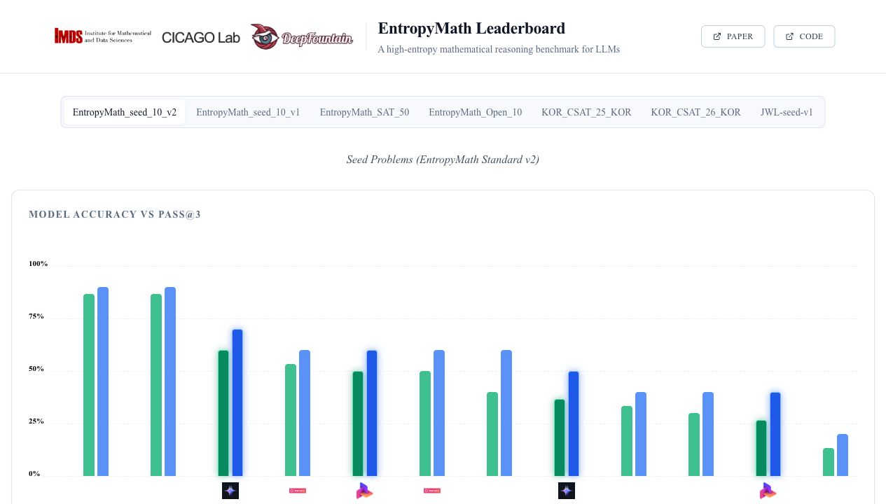
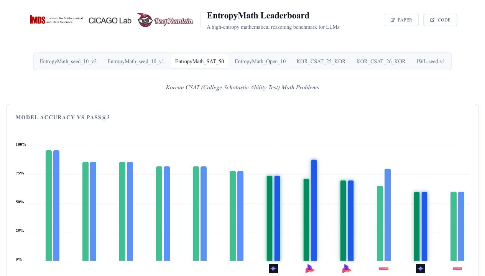

# EntropyMath Eval

Evaluation utilities for running and analyzing EntropyMath-style mathematical
reasoning benchmarks. The framework supports Korean and multilingual math
tasks, direct-answer evaluation, Python-tool-assisted solving, repeated runs for
Pass@k, and summary generation for leaderboard-style reporting.

- Website and leaderboard: [entropymath.com](https://entropymath.com/)
- SAT benchmark view: [EntropyMath_SAT_50](https://entropymath.com/?dataset=entropy_math_sat)
- Package name: `math_eval_v7`
- Python: `>=3.12`

## Leaderboard Figures

EntropyMath tracks both accuracy and Pass@3 because math reasoning can vary
across repeated generations. The public leaderboard also exposes token-usage
views and per-problem traces for transparent comparison.





## What This Repo Contains

- `src/math_eval_v7/`: solver, prompt, API-client, and tool-execution modules
- `configs/competitions/`: benchmark dataset definitions
- `configs/models/`: model/provider runtime configurations
- `configs/model_panels/`: reusable model panels for batch evaluation
- `data/`: bundled EntropyMath evaluation data and manifests
- `scripts/`: run, summarize, regrade, and analysis entrypoints
- `outputs/`: checked-in compact summary JSON files for selected runs

Large local artifacts, virtual environments, caches, raw run traces, and model
weights are intentionally ignored by git.

## Installation

This project uses `uv`.

```bash
uv sync
```

For API-backed models, export the relevant provider key before running:

```bash
export OPENAI_API_KEY=...
export OPENROUTER_API_KEY=...
export FRIENDLI_API_KEY=...
export UPSTAGE_API_KEY=...
```

You can also pass a dotenv file at runtime:

```bash
uv run python scripts/run.py \
  --dotenv .env \
  --comp entropymath_generated_v1_model_eval_120 \
  --model openrouter_gpt_5_4_mini \
  --solver direct \
  --n_repeats 3
```

Model YAML files use `${ENV_VAR}` placeholders for provider secrets. The runner
resolves those placeholders after loading `--dotenv`, so keys stay out of git.

## Quick Start

Run a small direct-answer smoke test:

```bash
uv run python scripts/run.py \
  --comp entropymath_generated_v1_model_eval_120 \
  --model openrouter_gpt_5_4_mini \
  --solver direct \
  --n_repeats 1 \
  --max-problems 5
```

Run a Pass@3-style evaluation:

```bash
uv run python scripts/run.py \
  --comp entropymath_generated_v1_model_eval_120 \
  --model openrouter_gpt_5_4_mini \
  --solver direct \
  --n_repeats 3
```

Summarize generated outputs:

```bash
uv run python scripts/summarize_entropymath_results.py \
  --input outputs/entropymath_generated_v1_model_eval_120 \
  --output outputs/entropymath_generated_v1_model_eval_120_summary.json
```

## Supported Evaluation Modes

| Mode | Solver | Typical use |
| --- | --- | --- |
| Direct | `--solver direct` | Standard no-tool model comparison |
| Tool assisted | `--solver tool` | Python REPL/tool-calling math solving |
| Repeated sampling | `--n_repeats N` | Pass@k and consistency analysis |
| Local model | `base_url: http://localhost:...` | vLLM/OpenAI-compatible local serving |

## Example Benchmarks

| Config | Purpose |
| --- | --- |
| `entropymath_generated_v1_model_eval_120` | 120-problem EntropyMath generated evaluation split |
| `entropy_math_seed_v2` | Seed benchmark aligned with the public leaderboard |
| `entropy_math_sat` | SAT-style EntropyMath benchmark |
| `math_500_v7` | MATH-500 evaluation variant |
| `aime_2025_1`, `aime_2025_2` | AIME 2025 benchmark slices |
| `KOR_CSAT_25_KOR`, `KOR_CSAT_26_KOR` | Korean CSAT math benchmark slices |

## Result Artifacts

Each run writes one JSON result per problem/repeat plus a `run_manifest.json`.
The manifest records the competition config, sanitized model configuration,
solver protocol, repeat count, parser/grader versions, and prompt hash.

Summary files report:

- `accuracy_at_1`
- `pass_at_k`
- 95% bootstrap confidence intervals
- consistency gap
- answer extraction failure rate
- tool/Python error rates
- slices by difficulty, operation, and generation bucket when metadata exists

## Notes

- Keep API keys in environment variables or local `.env` files.
- Do not commit `.venv/`, raw `outputs/**` traces, `logs/`, or model weights.
- The public EntropyMath leaderboard is the canonical source for live model
  rankings; local results in this repo are reproducibility artifacts.
